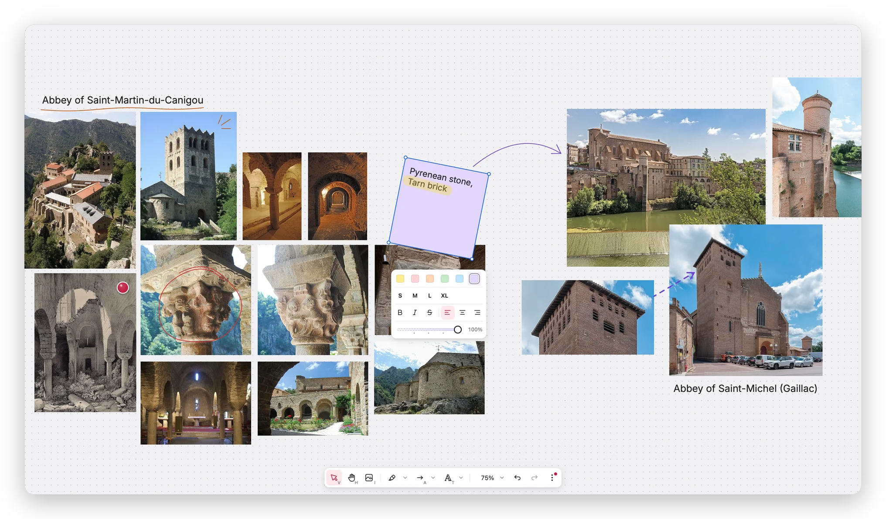

<picture>
  <source media="(prefers-color-scheme: dark)" srcset="./.github/assets/logo_light.svg" />
  
</picture>

A cross-platform board for your references and visual research. Fast, open source, agent-ready, and stored as plain files. Try Planche in your [browser](https://planche.bruits.org) now, or download the app for macOS, Windows, or Linux from the [latest release](https://github.com/bruits/planche/releases/latest).

<picture>
  <source media="(prefers-color-scheme: dark)" srcset="./.github/assets/screenshot_dark.webp" />
  
</picture>

## Acknowledgements

Planche builds on the work of several open-source projects:

- [wgpu](https://wgpu.rs/), the GPU API in Rust that draws every board, in browsers through WebGPU and WebGL2
- [Tauri](https://v2.tauri.app/), which wraps the web app into a desktop app
- [wasm-bindgen](https://github.com/wasm-bindgen/wasm-bindgen), through which the web app runs the Rust core
- [rmcp](https://github.com/modelcontextprotocol/rust-sdk), the official Rust SDK for MCP
- [Inter](https://rsms.me/inter/) by Rasmus Andersson, the app main typeface
- [Tabler Icons](https://tabler.io/icons) by Paweł Kuna, the icons of the toolbar

Thank you to everyone who contributes, or would like to. [CONTRIBUTING.md](./CONTRIBUTING.md) is the place to start, and the [docs](./docs/) explain the choices behind the code.

Planche is an open-source project born from [Bruits](https://bruits.org/), a Rust-focused collective 💛
